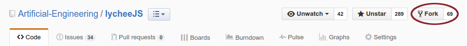
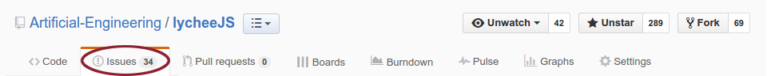
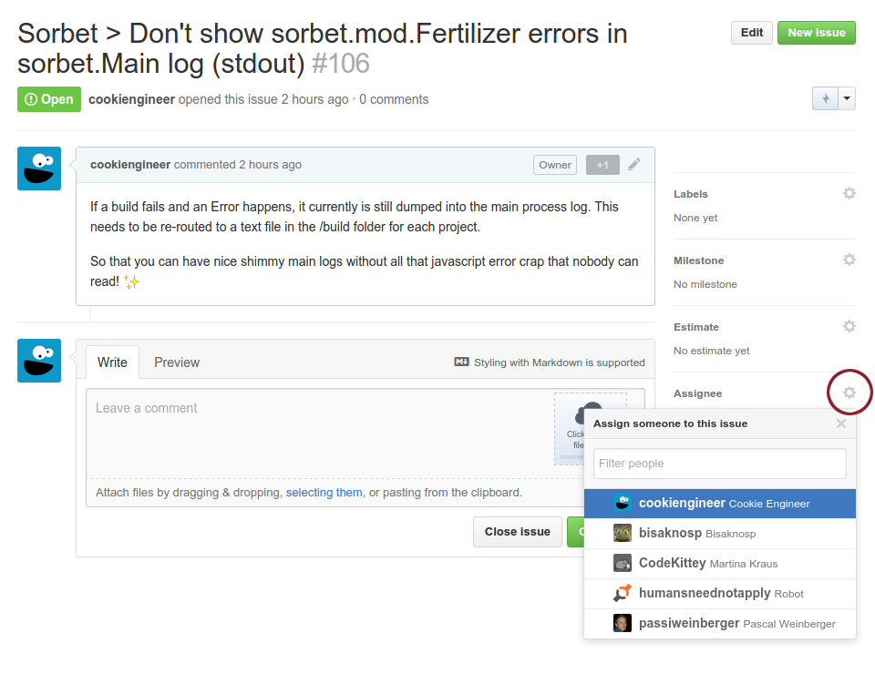

# Organization

- [Fork Management](#fork-management)

1. [Erstelle/ suche einen Issue](#find-an-issue)
2. [Zuweisung eines Issues](#assign-an-issue)

## Fork Management

Ein Fork ist eine vollst&auml;ndige Kopie des Repos. Dieser Fork taucht dann als komplett eigenes Repo in deinem Github Account auf. Mit diesem Repo kannst du dann selbst herumexperimentieren wie du willst und sogar weitere Features entwickeln ohne das originale Repository zu ver&auml;ndern.
Meistens werden Forks f&uuml;r Bugfixings genutzt oder um neue Features zu implementieren.

Um ein Repo zu forken musst du auf das jeweilige Repo nat&uuml;rlich Zugriff haben. 
Danach klickst du auf den Button **fork**


In diesem Beispiel wird das Repository **lycheeJS** geforked; Dieses wird auch in der weiteren Erkl&auml;rung als Beispiel herangezogen.

Danach kannst du noch ausw&auml;hlen ob du das Repo in eine Organization oder deinen normalen Github Account forken m&ouml;chtest und das war es auch schon.

Nun kannst du diese Repo (deine eigene lokale Kopie in Github) auch wieder auf deinem Rechner auschecken:

```bash
$ git clone http://github.com/YOUR-ACCOUNTNAME/lycheeJS
```
Nun hast du auch eine lokale Kopie des Repos auf deinem Rechner.

Nun kannst du an dem Repo weiterarbeiten. Allerdings musst du auch darauf achten, dass dein Fork immer wieder gesynct mit dem originalen Repo ist. Die erreichst du, wenn du in deiner lokalen Kopie auf dem Rechner das originale Repo regelm&auml;ssig *pullst*

```bash
$ git pull https://github.com/Artificial-Engineering/lycheeJS.git
```
Jetzt werden alle Updates des originalem Repo in dein lokales Repo auf dem Rechner &uuml;bertragen.
Diese sind aber noch nicht in dem remote Repo welches auf Github.com gehostet ist, deswegen musst du das noch einmal pushen. Dieser Push landet nat&uuml;rlich wieder nur in deinem Github Fork: http://github.com/YOUR-ACCOUNTNAME/lycheeJS


```bash
$ git push
```

[Github Dokumentation Fork Management](https://help.github.com/articles/fork-a-repo/)

Wenn du mit dem Feature oder dem Bugfixing fertig bist, sollen deine &Auml;nderungen auch wieder in das originale Repo zur&uuml;ck gemerged werden. Hierf&uuml;r bietet Github einen sogenannten *Pull Request* an.

Nachdem du &Auml;nderungen vorgenommen hast taucht rechts oben ein Button **Compare & pull Request** auf. 


Wenn du diesen Klickst, siehst du nochmal all deine &Auml;nderungen und kannst nochmal einen Text dazu formulieren.
Mit diesem Pull Request stellst du eine Anfrage an den Maintaner des originalen Repos deine &Auml;nderungen mit in das originale Repo zu &uuml;bernehmen. 
Ist alles sauber und angemessen (bzgl. Coding Guidelines und Benennungen) implementiert wird der Maintaner den Pull Request akzeptieren oder dir gegebenenfalls Feedback dazu geben.

[Github Dokumentation Pull Request](https://help.github.com/articles/using-pull-requests/)

Diesen Prozess
* Pullen des originalen Repos
* Pushen in den eigenen lokalen Fork
* Pull Request von dem eigenen lokalen Fork in das originale Repo

Nennt man auch **Triangle wrokflow**


## Find an Issue

Alle Bugs oder Features Request werden in Git mithilfe von Issues organisiert.
Eine &Uuml;bersicht aller offenen Issues (wo du dann auch selbst Issues erstellen kannst) findest du oberhalb des Repo-Fensters:



## Assign an Issue

Sobald du einen Issue gefunden hast den du bearbeiten m&ouml;chtest solltest du dir diesen zuweisen, damit jeder wei&szlig; , dass du daran arbeitest. 



